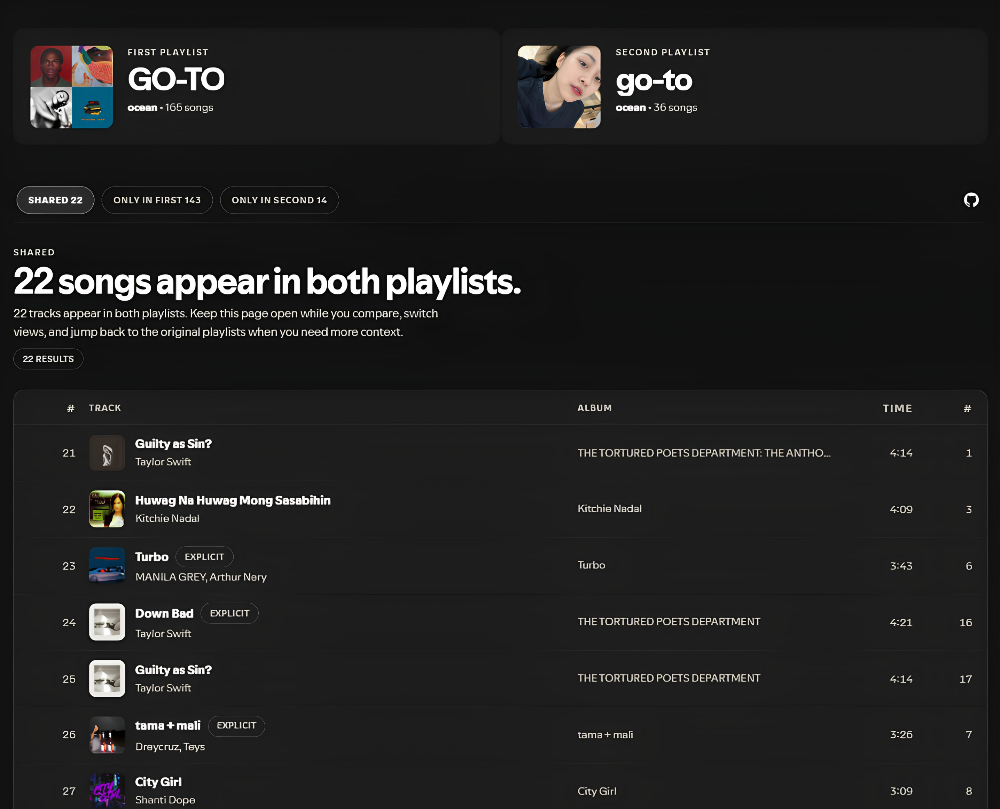
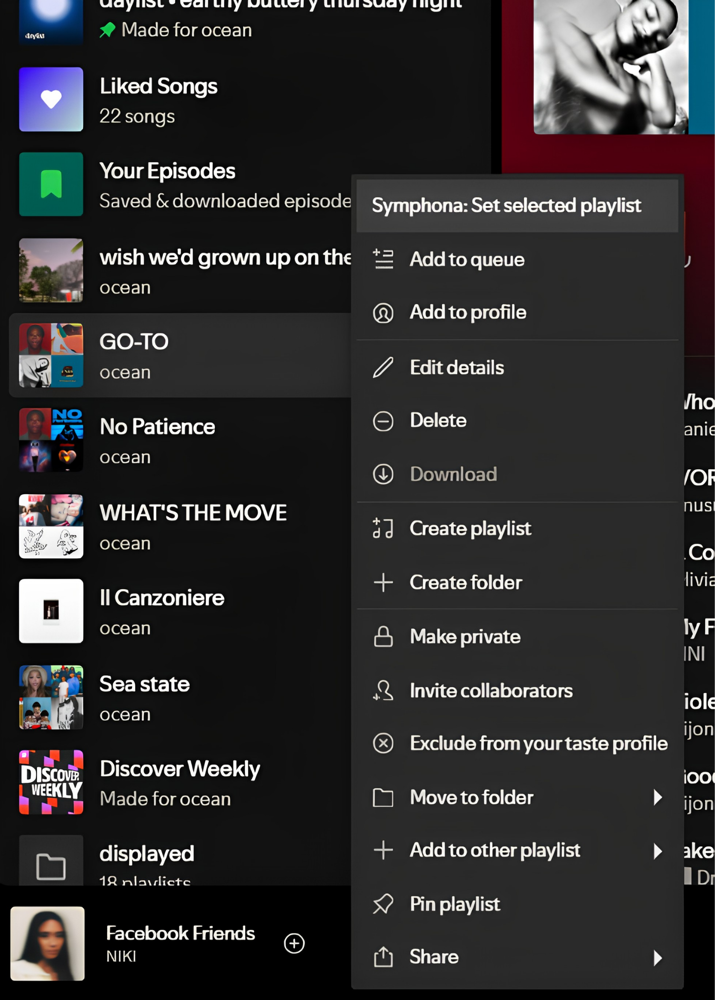
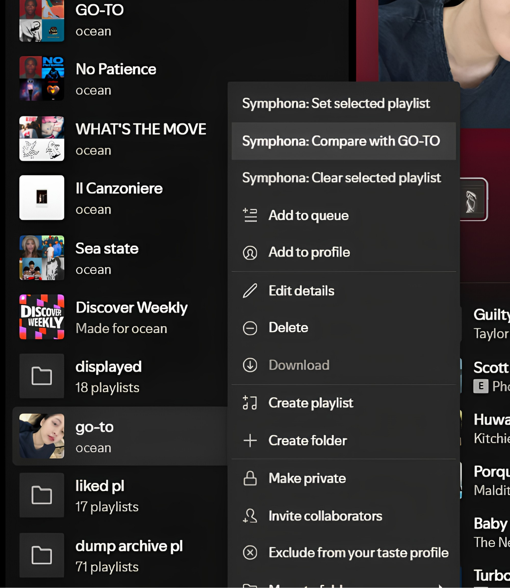

<p align="center">
  
</p>

<h1 align="center">Symphona</h1>

<p align="center">
  A routed playlist intersection extension for Spicetify with a premium split-hero workspace and responsive comparison views.
</p>

<p align="center">
  
  
  
  
</p>

<p align="center">
  
</p>

## Overview

Symphona is a modern Spicetify extension for comparing two playlists in a dedicated routed page instead of a cramped modal. It was built as a professional, presentation-first rewrite of playlist intersection tooling, with a calmer visual language inspired by Melior and a stronger emphasis on responsive UX, scale, and readability.

The extension keeps the interaction simple:

1. Select a source playlist from Spotify's context menu.
2. Compare it against another playlist.
3. Open a full workspace with shared tracks, first-only tracks, and second-only tracks.
4. Review the overlap or exclusive sets without leaving the comparison route.

## Key Features

| Feature | Details |
| --- | --- |
| Routed comparison page | Opens a full-page workspace using `Spicetify.Platform.History` instead of relying on a popup. |
| Split-hero layout | Presents both playlists as equal subjects before moving into the result workspace. |
| Three comparison modes | Switch instantly between `Shared`, `Only in First`, and `Only in Second`. |
| Modern Spicetify APIs | Built around current `Spicetify.Platform`, `ContextMenu.Item`, `React`, and injected styling. |
| Responsive UI | Works across wider desktop layouts and narrower Spotify window sizes without falling apart. |
| Single-file delivery | Ships as one `symphona.js` extension file with embedded styling. |
| Cached loading | Reuses fetched playlist metadata and paginated track data to keep switching views fast. |

## Gallery

<table>
  <tr>
    <td width="50%">
      
      <p align="center"><sub>Select the first playlist directly from Spotify's context menu.</sub></p>
    </td>
    <td width="50%">
      
      <p align="center"><sub>Launch the comparison against a second playlist in one step.</sub></p>
    </td>
  </tr>
  <tr>
    <td colspan="2">
      
      <p align="center"><sub>Review overlap and exclusive tracks in a dedicated routed workspace.</sub></p>
    </td>
  </tr>
</table>

## Installation

### Marketplace

This repository is prepared for Spicetify Marketplace discovery with:

- a root `manifest.json`
- the correct extension entry point
- a public repository structure that matches the Marketplace publishing requirements

After the repository is public and tagged correctly on GitHub, Symphona can be discovered through the Marketplace indexing flow. If indexing has not propagated yet, manual installation is available immediately.

### Manual Installation

1. Download `symphona.js`.
2. Copy it into your Spicetify Extensions folder.

Platform paths:

| Platform | Extensions folder |
| --- | --- |
| Windows | `%appdata%\\spicetify\\Extensions\\` |
| macOS / Linux | `~/.config/spicetify/Extensions/` |

3. Enable the extension:

```bash
spicetify config extensions symphona.js
spicetify apply
```

If you already use other extensions, append `symphona.js` instead of replacing your existing entries.

## How To Use

1. Right-click a playlist and choose `Symphona: Set selected playlist`.
2. Right-click another playlist and choose `Symphona: Compare with <selected playlist>`.
3. Symphona opens a routed comparison page.
4. Switch between:
   - `Shared`
   - `Only in First`
   - `Only in Second`
5. Use the GitHub icon or playlist links to move between the comparison and the source playlists.
6. Double-click any result row to play that track immediately.

## Technical Notes

- Built as a single-file extension with embedded style injection.
- Uses paginated playlist loading through modern Spicetify platform APIs.
- Compares tracks by URI for stable intersections and exclusive sets.
- Keeps view state in the route so comparisons are deep-linkable and revisit-friendly.
- Uses a responsive result layout that preserves the same comparison data across desktop and tighter windows.

## Inspiration and Attribution

Symphona is heavily inspired by [playlistIntersection from huhridge/huh-spicetify-extensions](https://github.com/huhridge/huh-spicetify-extensions/tree/main/playlistIntersection).

This project is not presented as a direct copy. It is a modernized, routed-page reinterpretation built around current Spicetify APIs, a redesigned comparison workflow, and a new UI direction tuned to sit beside Melior-style interfaces.

## Related Projects

- [View Playlists With Song](https://github.com/pandadoor/spicetify-melior) - another Spicetify extension by the same author for discovering every playlist that contains a selected song.

## Repository Contents

| Path | Purpose |
| --- | --- |
| `symphona.js` | The extension entry point and full shipped implementation |
| `manifest.json` | Marketplace metadata |
| `assets/` | Preview graphics and icon assets used in documentation and Marketplace presentation |
